# The Ultimate Study of Artist Styles Portrayed by Stable Diffusion 
this study reviews artists original styles and and the effect of stable diffusion. this experiment looked at artists in isolation as best as possible to see how 1 artist, a simple prompt and stable diffusion would yield results. my source images and word tags associated with artists i find foundationally inspirational both for ai generated art i enjoy the results of as well as styles i try to replicate through my own sketches and paintings.

A note on the generated content below is that perception based selection was used to pick out visually interesting pictures rather then taking exactly what was generated from a first pass. that is why seed numbers are not referenced in many cases below. the goal was to show what is possible using influence from each artist rather then simply what the first generated image would be. 

 
 

# **Anton Fadeev**
https://www.artstation.com/shant
> **TAGS:** concept, digital, game, landscapes, colorful, painted

 

## **Originals**
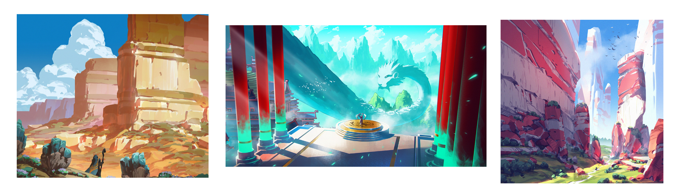

## **prompt**: `path through cavern landscape anton fadeev`
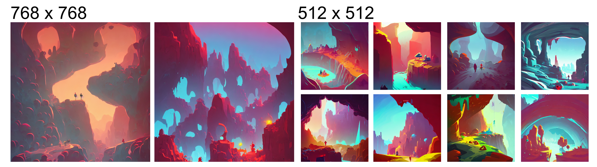

 
 
 
 

# **Tyler Edlin**
https://www.artstation.com/tyleredlinart
> **TAGS:** concept, digital, game, landscapes, colorful, realistic, epic, detailed, painted
> 
## **Originals**
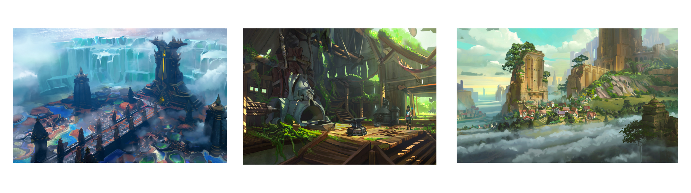

## **prompt**: `path through cavern landscape Tyler Edlin`
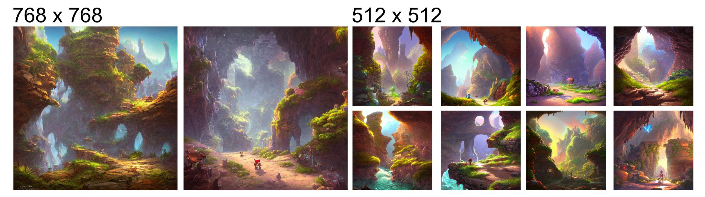

 
 
 
 

# **Trent Kaniuga**
https://www.artstation.com/trentkaniuga
> **TAGS:** concept, digital, game, colorful
> 
## **Originals**

## **prompt**: `path through cavern landscape Trent Kaniuga`

 
 
 
 

# **Ian McQue**
> **TAGS:** concept, digital, landscapes, painted

 

## **Originals**
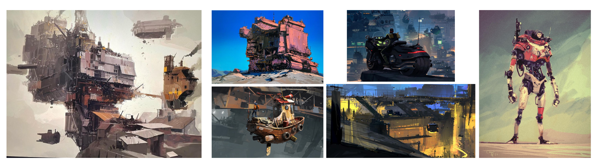

## **prompt**: `path through cavern landscape Ian McQue`
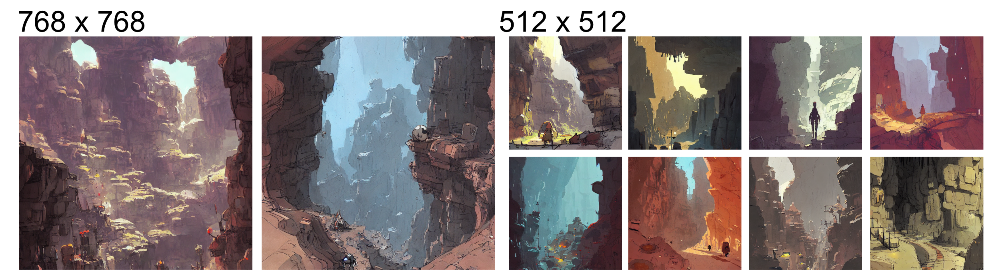

 
 
 
 

# **Neil Blevins**
https://www.artstation.com/artofsoulburn
> **TAGS:** concept, digital, landscapes, painted, dark, characters

 

## **Originals**
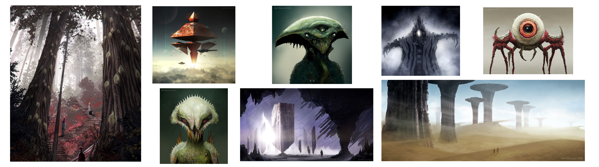

## **prompt**: `path through cavern landscape Neil Blevins`

 
 
 
 

# **John Berkey**
https://conceptartworld.com/artists/john-berkey-1932-2008/
> **TAGS:** concept, digital, landscapes, painted, dark, characters, scifi

 

## **Originals**
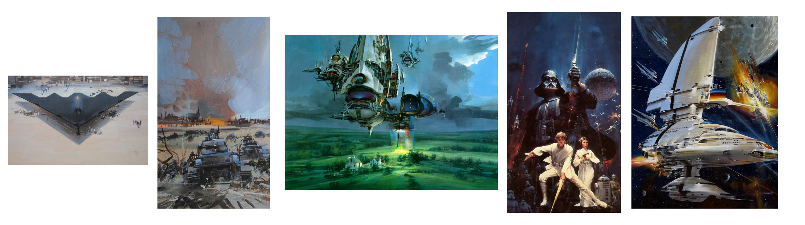

## **prompt**: `path through cavern landscape John Berkey`
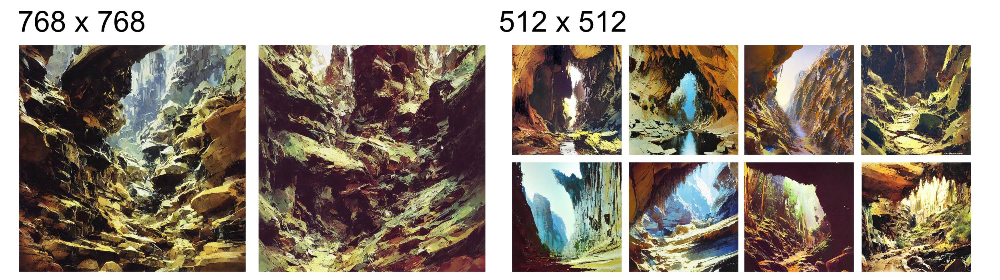

 
 
 
 

# **Raphael Lacoste**
https://www.raphael-lacoste.com/projects
> **TAGS:** concept, digital, landscapes, painted

 

## **Originals**
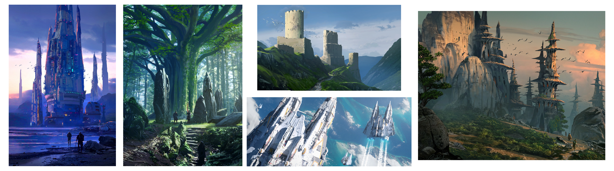

## **prompt**: `path through cavern landscape Raphael Lacoste`
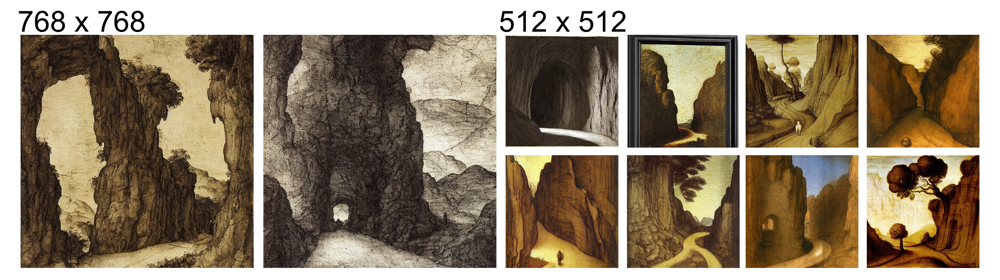

 
 
 
 

# **Martin Deschambault**
https://www.artstation.com/dechambo
> **TAGS:** concept, digital, landscapes, painted, ubisoft, fantasy, scifi

 

## **Originals**
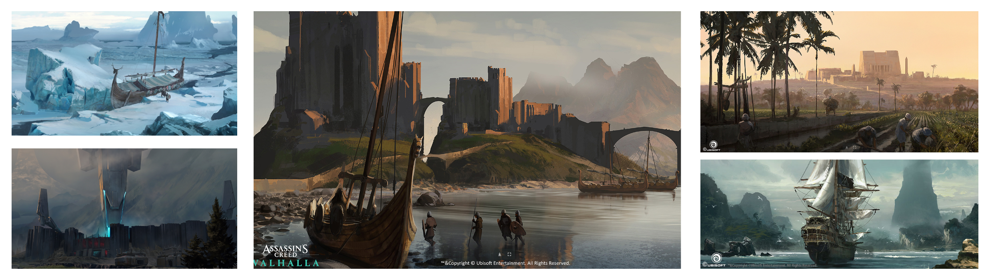

## **prompt**: `path through cavern landscape Martin Deschambault`
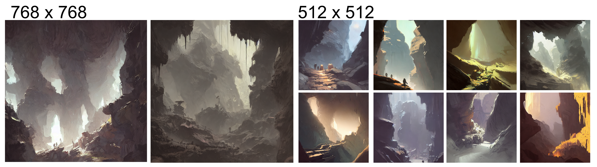

 
 
 
 

# **Seb McKinnon**
https://www.sebmckinnon.com/
> **TAGS:** concept, digital, landscapes, painted, fantasy, scifi

 

## **Originals**
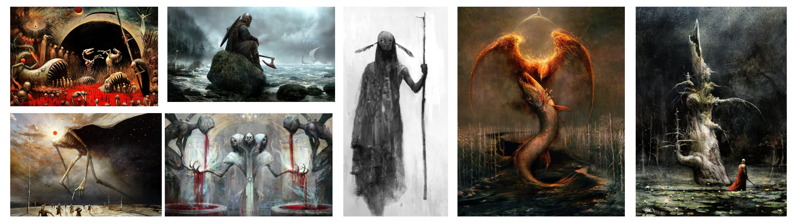

## **prompt**: `path through cavern landscape Seb McKinnon`
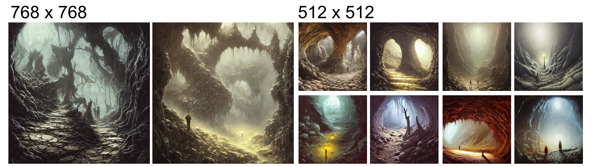

 
 
 
 

# **Matthew Stewart**
http://www.matthew-stewart.com/
> **TAGS:** concept, digital, landscapes, painted, fantasy

 

## **Originals**
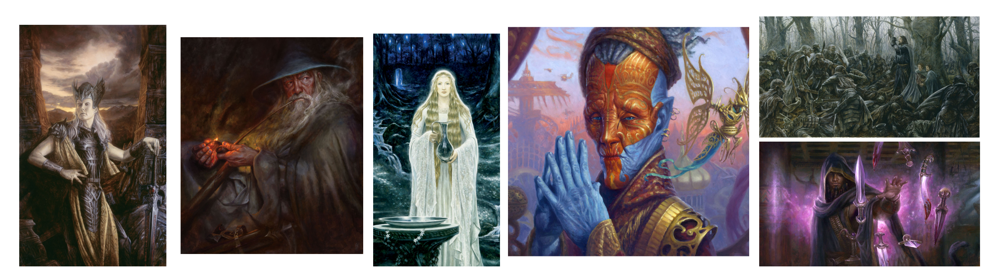

## **prompt**: `path through cavern landscape Matthew Stewart`

 
 
 
 

# **Peter Draws**
https://www.peterdraws.com/

> **TAGS:** 

 

## **Originals**
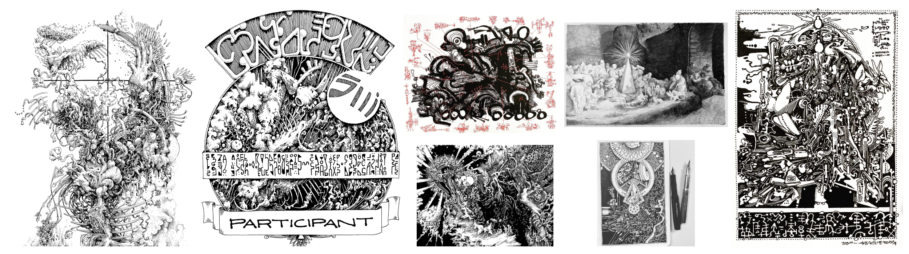

## **prompt**: `path through cavern landscape peter draws`
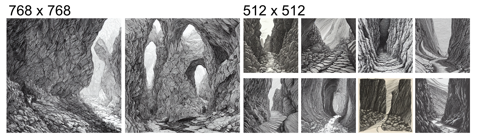

 
 
 
 

# **Sam Does Art**
https://www.instagram.com/samdoesarts

> **TAGS:** 

 

## **Originals**
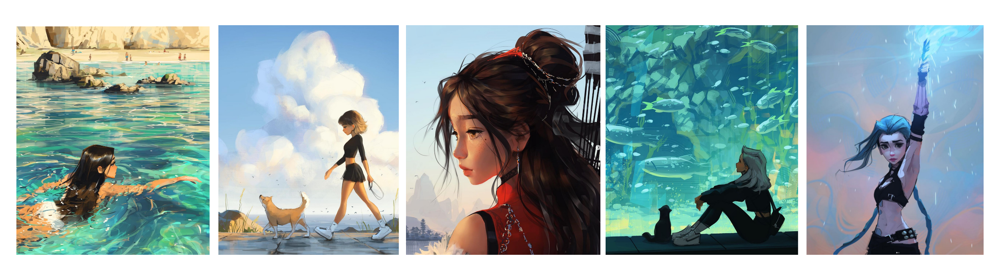

## **prompt**: `path through cavern landscape Sam Does Art`
> **NOTE:** this was a great example of a famous social media based artist who was "likely" not included in the training dataset. The model appears to have simply ignored the artist name in the prompt and attempted to generated the content conveyed by the other words.
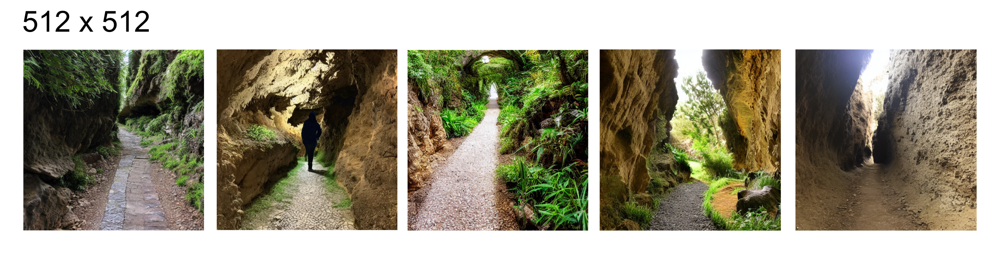

 
 
 
 

# **Bill Peet**
http://www.billpeet.net/
> **TAGS:** 

 

## **Originals**
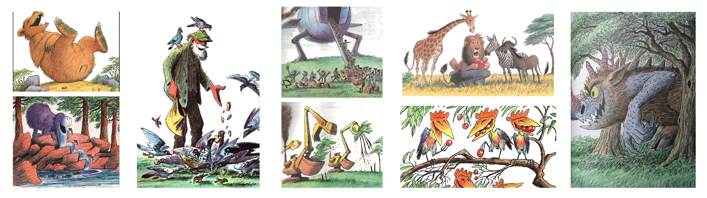

## **prompt**: `path through cavern landscape Bill Peet`
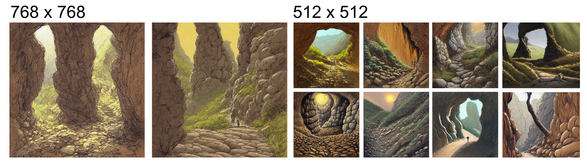

 
 
 
 

# John William Waterhouse
https://en.wikipedia.org/wiki/John_William_Waterhouse
> **TAGS:** academic style, painted, mythology, 

## **Originals**
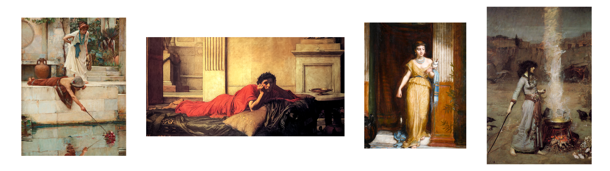

## **prompt**: `path through cavern landscape john william waterhouse`
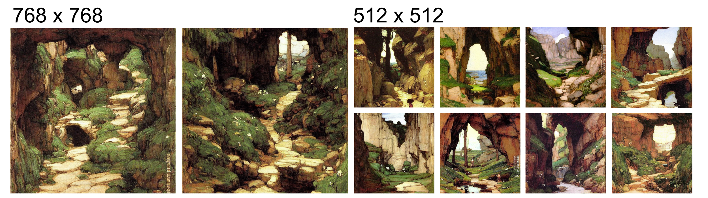

 
 
 
 

# **Salvador Dali**
> **TAGS:** abstract, sureal

 

## **Originals**
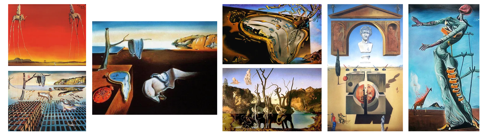

## **prompt**: `path through cavern landscape Salvador Dali`
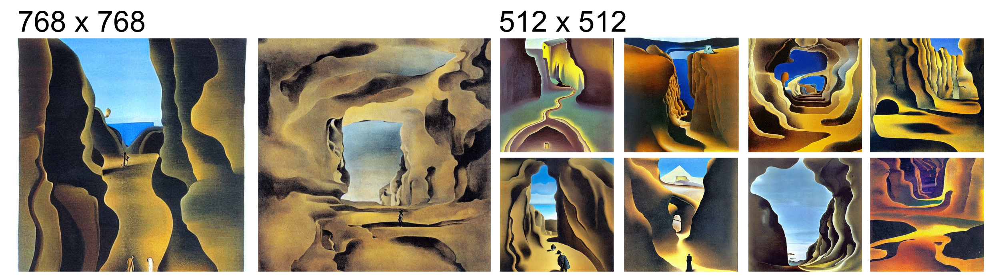

 
 
 
 

# **Leonardo da Vinci**
> **TAGS:** 

## **Originals**
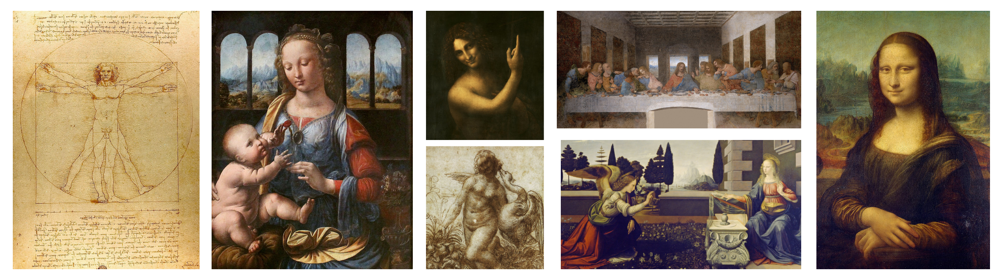

## **prompt**: `path through cavern landscape leonardo da vinci`
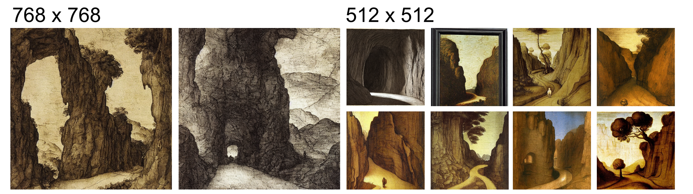

 
 
 
 

# **Hubert Robert**
> **TAGS:** 

## **Originals**
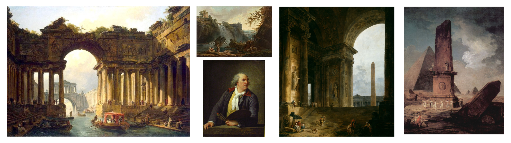

## **prompt**: `path through cavern landscape Hubert Robert`
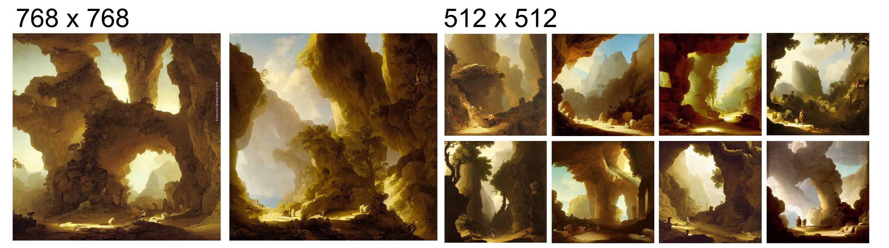

 
 
 
 

# **HR Giger**
> **TAGS:** 

## **Originals**
...

## **prompt**: `path through cavern landscape hr giger`
...

 
 
 
 

# **Ugarte**
> **TAGS:** 

## **Originals**
...

## **prompt**: `path through cavern landscape ugarte`
...

 
 
 
 

# **Vincent van Gogh**
> **TAGS:** 

## **Originals**
...

## **prompt**: `path through cavern landscape Van Gogh`
...

 
 
 
 

# **Eyvind Earle**
> **TAGS:** 

## **Originals**
...

## **prompt**: `path through cavern landscape Eyvind Earle`
...

 
 
 
 

