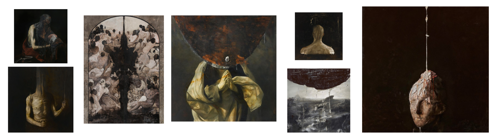
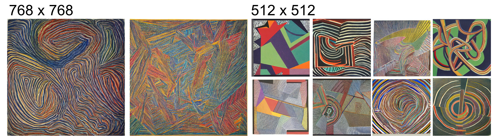

# The Ultimate Study of Artist Styles Portrayed by Stable Diffusion 
this study reviews artists original styles and and the effect of stable diffusion. this experiment looked at artists in isolation as best as possible to see how 1 artist, a simple prompt and stable diffusion would yield results. my source images and word tags associated with artists i find foundationally inspirational both for ai generated art i enjoy the results of as well as styles i try to replicate through my own sketches and paintings.

A note on the generated content below is that perception based selection was used to pick out visually interesting pictures rather then taking exactly what was generated from a first pass. that is why seed numbers are not referenced in many cases below. the goal was to show what is possible using influence from each artist rather then simply what the first generated image would be. 

 
 
 
 

# Digital Artists
## **Anton Fadeev**
https://www.artstation.com/shant
> **TAGS:** concept, digital, game, landscapes, colorful, painted

 

    <b>Originals</b>

 

    <b>Prompt:</b> path through cavern landscape anton fadeev

 
 
 

## **Tyler Edlin**
https://www.artstation.com/shant
> **TAGS:** concept, digital, game, landscapes, colorful, painted

 

    <b>Originals</b>

 

    <b>Prompt:</b> path through cavern landscape Tyler Edlin

 
 
 

## **John Berkey**
https://conceptartworld.com/artists/john-berkey-1932-2008/
> **TAGS:** concept, digital, landscapes, painted, dark, characters, scifi

 

    <b>Originals</b>

 

    <b>Prompt:</b> path through cavern landscape Tyler Edlin

 
 
 

## **Ian McQue**
https://conceptartworld.com/artists/john-berkey-1932-2008/
> **TAGS:** concept, digital, landscapes, painted

 

    <b>Originals</b>

 

    <b>Prompt:</b> path through cavern landscape Ian McQue

 
 
 

## **Neil Blevins**
https://www.artstation.com/artofsoulburn
> **TAGS:** concept, digital, landscapes, painted, dark, characters

 

    <b>Originals</b>

 

    <b>Prompt:</b> path through cavern landscape Neil Blevins

 
 
 

## **Seb McKinnon**
https://www.artstation.com/artofsoulburn
> **TAGS:** concept, digital, landscapes, painted, fantasy, scifi

 

    <b>Originals</b>

 

    <b>Prompt:</b> path through cavern landscape Seb McKinnon

 
 
 

# **Raphael Lacoste**
https://www.raphael-lacoste.com/projects
> **TAGS:** concept, digital, landscapes, painted

 

## **Originals**

## **prompt**: `path through cavern landscape Raphael Lacoste`

 
 
 

# **Martin Deschambault**
https://www.artstation.com/dechambo
> **TAGS:** concept, digital, landscapes, painted, ubisoft, fantasy, scifi

 

## **Originals**

## **prompt**: `path through cavern landscape Martin Deschambault`

 
 
 
 

 
 
 
 
 
 

# Classical Artists

## **Salvador Dali**
> **TAGS:** abstract, sureal

 

    <b>Originals</b>

 

    <b>Prompt:</b> path through cavern landscape Salvador Dali

 
 
 

## **Nicola Samori**
https://www.peterdraws.com/

> **TAGS:** 

 

    <b>Originals</b>

    <b>Prompt:</b> path through cavern landscape Nicola Samori

 
 
 

## **Leonardo da Vinci**
> **TAGS:** 

    <b>Originals</b>

 

    <b>Prompt:</b> path through cavern landscape leonardo da vinci

 
 
 

## **John William Waterhouse**
https://en.wikipedia.org/wiki/John_William_Waterhouse
> **TAGS:** academic style, painted, mythology, 

    <b>Originals</b>

 

    <b>Prompt:</b> path through cavern landscape John William Waterhouse

 

 
 
 

## **Hubert Robert**
> **TAGS:** 

    <b>Originals</b>

 

    <b>Prompt:</b> path through cavern landscape Hubert Robert

 
 
 
 
 
 

# Abstract \ Minimalist Artists

## **Frank Stella**
> **TAGS:**

    <b>Originals</b>

    <b>Prompt:</b> path through cavern landscape Frank Stella

 
 
 
 
 
 

# Modern Artists

## **Peter Draws**
https://www.peterdraws.com/

> **TAGS:** 

 

    <b>Originals</b>

 

    <b>Prompt:</b> path through cavern landscape Peter Draws

 
 
 

## **Bill Peet**
http://www.billpeet.net/

> **TAGS:** 

 

    <b>Originals</b>

 

    <b>Prompt:</b> path through cavern landscape Bill Peet

 
 
 

## **Sam Does Art**
https://www.instagram.com/samdoesarts

> **TAGS:** 

 

    <b>Originals</b>

 

    <b>Prompt:</b> path through cavern landscape Bill Peet

 

> **NOTE:** this was a great example of a famous social media based artist who was "likely" not included in the training dataset. The model appears to have simply ignored the artist name in the prompt and attempted to generated the content conveyed by the other words.

 
 
 
 
 
 

# Upcoming Artist Entries
- Albrecht Dürer
- HR Giger
- Ugarte
- Vincent van Gogh
- Eyvind Earle

